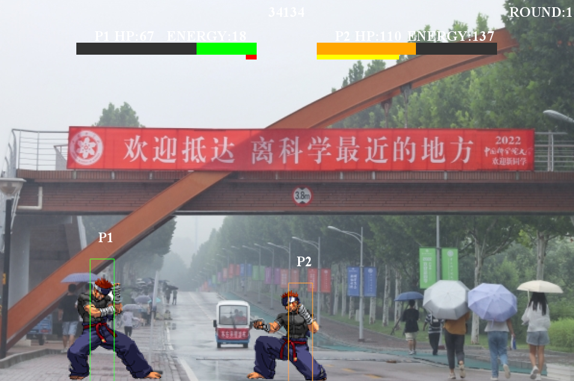

# 国科大强化学习格斗游戏大作业
基于FightingICE平台实现的Fighting Game 强化学习训练和测试，支持训练角色选择
## 项目简介

中国科学院大学2025春季学期强化学习大作业——基于FightingICE平台的强化学习格斗游戏。
使用Q-Learning、SARSE和DQN算法在无限血量模式下训练，支持无限血量测试和限制血量测试


## 文件结构
* 仅列出重要文件
```
RL_fightinggame/
├── checkpoints/                        # 训练数据存储文件夹
│   └── SARSA/                          # 该算法权重存储文件夹
│       └──ZEN/                         # ZEN角色权重存储文件夹
├── methods/                            # 训练算法代码文件夹
│   └──DQN.py                           # DQN算法代码实现
│   └── ......                          # 其他算法代码
├── test_limithp_log/                   # 限制血量测试log存储文件夹
├── test_log/                           # 无限血量测试log存储文件夹
├── train_log/                          # 训练log存储文件夹
├── report/                             # 项目报告存储文件夹
│   └──fig/                             # 图片资源文件夹
│   └──record.mp4                       # Sarsa算法测试结果录屏
│   └──report.pdf                       #项目报告
├── train.py                            # 训练代码       
├── test.py                             # 无限血量测试代码
├── test_limithp.py                     # 限制血量测试代码
├── visualize_test_log.py               # 测试log可视化分析代码
├── visualize_train_log.py              # 训练log可视化分析代码
├── readme.md                           # 项目文档
└── ......                              # 已提供的文件和代码
``` 

## 环境依赖

### Python依赖
```bash
pip install gym
pip install py4j==0.10.4
pip install port_for
pip install matplotlib
```
### Java环境
- 建议Java 8 ( 确保JAVA_HOME环境变量正确设置)

### 系统要求
- Windows 10/11

## 训练
在无限血量模式下进行训练，Q-Learning训练了500epoch，SARSA和DQN训练了300epoch，选择角色为ZEN
```bash
python train.py \
    --method SARSA \
    --player ZEN \
    --save_path ./checkpoints \
    --log_path ./train_log \
    --epochs 300\
    --batch_size 32
```

## 测试
### 无限血量测试
```bash
python test.py \
    --method SARSA \
    --player ZEN \
    --CKPT ./checkpoint/SARSA/ZEN/best-299.npy \
    --Rounds 100 \
    --log_path ./test_log
```

取训练中血量差最好的一轮训练参数，选择角色为ZEN，进行100个回合测试，结果如下：
| 算法 | 胜率(%) |
|:---------:|:---------:|
|Q-Learning |18|
|Sarsa      |53|
|DQN        |56|

### 限制血量测试
```bash
python test_limithp.py \
    --method SARSA \
    --player ZEN \
    --CKPT ./checkpoints/SARSA/ZEN/best-299.npy \
    --Rounds 50 \
    --max_hp 200 \
    --log_path ./test_limithp_log
```
取训练中血量差最好的一轮训练参数，选择角色ZEN，血量限制200，进行100个回合测试，结果如下：
| 算法 | 胜率(%) |
|:---------:|:---------:|
|Q-Learning |44|
|Sarsa      |75|
|DQN        |70|

## 可视化
直接运行`visualize_test_log.py`和`visualize_train_log.py`即可，会在log文件夹的对应路径下生成可视化结果
## Next Step
`fightingice_env.py`文件下的170行，提供了选择不同角色的方法，可以考虑在训练中随机更换对战角色训练，但训练和测试耗时较长，未进行
```
self.game_to_start = self.manager.createGame(self.character, self.character,
                                        self.p1_name, self.p2_name, self.freq_restart_java)
```

## 项目成员和分工
| 姓名 | 学号 | 分工 |
|:---------:|:---------:|:---------:|
| 潘昱锜   | 202418014628018 | Sarsa算法代码实现、实验数据处理和分析、报告撰写  |
| 温尧智   | 2024180204280028   | Q-Learning算法代码实现、训练环境搭建和模型训练、测试、报告撰写   |
| 谷绍伟   |  202418020428007   | DQN算法代码实现、环境搭建、模型测试、实验数据处理分析、报告撰写|
